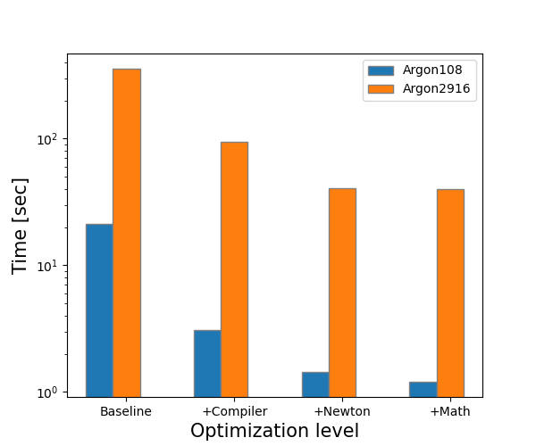
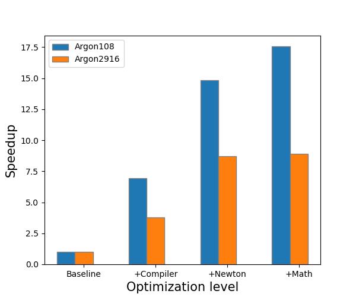
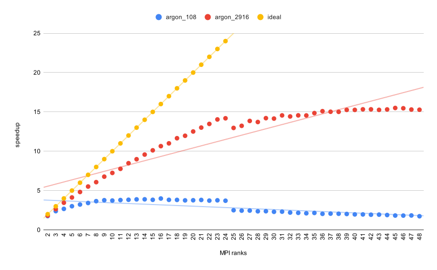

## Group 1:

- Celoria, Marco &rarr; marco-celoria
- Hasanuzzaman, Mohammad &rarr; hasanictp
- Barnaba, Matteo &rarr; mbarnaba

## to compile and run the code
cmake is required! 
```
./compile.sh [build_dir]
```
where build_dir is optional (if not given it will default to './build') and can be 
any directory. 
By default `compile.sh` will compile the code with all the best optimizations, with MPI support and with Testing and Google test enabled.
However, the users can turn on or off several compile options according to their preferences and/or run tests by means of cmake and:

```
>> mkdir build_dir
>> cd build_dir
>> cmake -DFLAG1=ON/OFF -DFLAG2=ON/OFF -DFLAG3=ON/OFF ..
>> make
>> ctest
```  

where `FLAGi i=1, 2, 3, ...` can be among

```
- USE_COMPILER   : Build with compiler optimizations enabled 
- USE_NEWTON     : Build with Newton's 3rd law algorithm
- USE_MATH       : Build with Newton's 3rd and fast math operations
- USE_MPI        : Build with MPI support
- USE_OMP        : Build with Open MP support
- ENABLE_TESTING : Enable Testing
- RUN_GTEST      : Enable Google tests
```

The option ENABLE_TESTING enables native testing: actually some tests are already implemented to check whether the code compiles and runs correctly. 
If MPI support is enabled, the test checks whether MPI runs and successfully finalizes.

The option RUN_GTEST enables Google Tests.
Some Google Tests have been already implemented to check whether some functions behave as expected, for instance if the kinetic energy is computed correctly or the periodic boundary conditions are correctly imposed.
For more details regarding testing, see the next section.

## testing 

Testing is enabled by default and you run the tests simply by running "ctest" from inside the build directory (build_dir). 
Both native testing and tests via Google Tests can be implemented and run. 
To add add new test simply add it to the relevant section inside CMakeLists.txt. 
```
if(ENABLE_TESTING)
    enable_testing()

    execute_process(
        COMMAND ${CMAKE_COMMAND} -E copy ${CMAKE_SOURCE_DIR}/examples/argon_108.inp ${CMAKE_CURRENT_BINARY_DIR}
    )
    execute_process(
        COMMAND ${CMAKE_COMMAND} -E copy ${CMAKE_SOURCE_DIR}/examples/argon_108.rest ${CMAKE_CURRENT_BINARY_DIR}
    )

    execute_process(
        COMMAND ${CMAKE_COMMAND} -E copy ${CMAKE_SOURCE_DIR}/examples/argon_2916.inp ${CMAKE_CURRENT_BINARY_DIR}
    )
    execute_process(
        COMMAND ${CMAKE_COMMAND} -E copy ${CMAKE_SOURCE_DIR}/examples/argon_2916.rest ${CMAKE_CURRENT_BINARY_DIR}
    )
    
    add_test(
        NAME RunTest 
        COMMAND /bin/sh -c "${CMAKE_CURRENT_BINARY_DIR}/${target} < argon_108.inp && test -f argon_108.dat && test -f argon_108.xyz"
    )
    set_tests_properties( RunTest PROPERTIES PASS_REGULAR_EXPRESSION ".*Simulation Done.*" )
    ...
```
or 
```
if (RUN_GTEST) 
    ...
   
    add_executable( 
        test_kinetic ${CMAKE_CURRENT_SOURCE_DIR}/tests/test_kinetic.cpp 
    )
    target_include_directories( test_kinetic PRIVATE ${CMAKE_SOURCE_DIR}/include )
    target_compile_definitions( test_kinetic PRIVATE MAKING_LIB )

...
```
Please add the "MAKING_LIB" definition to your test (as show above) because MPI and Google Tests do not get along and otherwise your test will not compile 
(sorry, I will fix this).

# Optimization benchmark

In this brief note we report our benchmark for the LJMD code.
Our main focus is the optimization of the serial code without considering parallelization aspects, specifically we optimized the force computation.

We have proceed incrementally:

Starting from the baseline code, we first improve performances by exploiting the compiler, using optimization flags.

Then, we have improved the algorithm by means of our knowledge of the physics of the system, specifically by taking advantage of Newton's third law.

Finally, we have considered additional optimization such as substituting costly mathematical operations with faster ones and improving the data structure.

Clearly, we have implemented these improvements having in mind that these shall be mergeable with MPI and OpenMP.
Tests have been performed by running the `benchmark.sh` script on one node with 12 cpu cores

```
Intel(R) Xeon(R) CPU E5-2697 v2 @ 2.70GHz
```

with the compiler `gcc` version `8.2.0`.

Particularly, we have measured the computational time, without counting the time it takes for input/output operations.
Two cases have been considered the first with 108 argon atoms with 10000 steps (`argon_108.inp`), the second with 2916 argon atoms and 1000 steps (`argon_2916.inp`).
We have performed 10 runs and calculated the average time.

Results are summarized in the following graphs 




The baseline time for 108 argon case is 21.2740526 seconds, while for the 2916 atoms we have 353.4211562 seconds.

By compiling the same baseline code with the following optimization flags 

```
-Wall -O3 -ffast-math -fomit-frame-pointer -fexpensive-optimizations -msse3 
```

we get 3.0546928 and 93.6310114 seconds for the 108 and 2916 atoms cases, respectively, corresponding to a speedup of roughly 7x and 4x.

By changing the algorithm to exploint Newton's third law we halve the computation and the computation time.
Specifically, we get 1.4319414 seconds for the 108 atom case and 40.519560 seconds for 2916 atoms, i.e. roughly 2x speedup.

Finally, by avoiding complex and costly mathematical operations (like powers, square roots and divisions) with simpler and more efficient ones together with a better use of data structure we get 1.2019493 seconds (1.2x) for the 108 atom cases and 39.6687816 seconds for 2916 atoms (only 1.02x indicating low performance improvement with system size).

```
                      argon_108                 argon_2916    
Optimization    seconds       speedup     seconds        speedup
Baseline        21.2740526    1.00        353.4211562    1.00
+Compiler        3.0546928    6.96438      93.6310114    3.77462
+Newton          1.4319414    14.8568      40.5195604    8.72224
+Math            1.2019493    17.6996      39.687816     8.90503
```


# MPI benchmark 


A benchmark for MPI has been performed measuring computation times for [1, 48] cores for both argon_108.inp and argon_2916.inp. 
The benchmark took place on 2 computational nodes with 24 Intel(R) Xeon(R) CPU E5-2697 v2 @ 2.70GHz processors. 
The executable was compiler with gcc-8.2.0 and openmpi-4.0.1.

The results are presented below, both in graphical and tabular form. 
The scaling is not bad but could be much better. 
It is however encouraging to see that the speedup improves with larger problem sizes. 





```
	argon_108		argon_2916	
ranks	seconds	speedup	seconds	speedup
1.00	1.49	1.00	38.47	1.00
2.00	0.85	1.76	21.14	1.82
3.00	0.63	2.39	14.56	2.64
4.00	0.56	2.67	11.14	3.45
5.00	0.50	3.01	9.33	4.12
6.00	0.46	3.23	7.98	4.82
7.00	0.44	3.42	6.98	5.51
8.00	0.41	3.65	6.34	6.07
9.00	0.39	3.78	5.68	6.77
10.00	0.40	3.73	5.31	7.24
11.00	0.39	3.80	4.95	7.76
12.00	0.39	3.83	4.54	8.48
13.00	0.38	3.88	4.28	8.99
14.00	0.38	3.89	4.02	9.58
15.00	0.39	3.83	3.80	10.12
16.00	0.37	3.99	3.61	10.65
17.00	0.39	3.82	3.50	11.00
18.00	0.39	3.81	3.30	11.66
19.00	0.40	3.75	3.21	11.97
20.00	0.40	3.77	3.08	12.51
21.00	0.39	3.81	2.96	13.01
22.00	0.40	3.72	2.86	13.47
23.00	0.40	3.76	2.74	14.04
24.00	0.40	3.71	2.71	14.19
25.00	0.60	2.50	2.97	12.96
26.00	0.61	2.45	2.91	13.23
27.00	0.61	2.46	2.78	13.85
28.00	0.63	2.37	2.80	13.71
29.00	0.63	2.38	2.71	14.20
30.00	0.65	2.30	2.72	14.15
31.00	0.64	2.32	2.64	14.56
32.00	0.68	2.21	2.67	14.42
33.00	0.69	2.17	2.64	14.56
34.00	0.71	2.11	2.64	14.55
35.00	0.69	2.16	2.59	14.85
36.00	0.73	2.04	2.55	15.09
37.00	0.72	2.07	2.56	15.02
38.00	0.73	2.05	2.56	15.01
39.00	0.74	2.02	2.52	15.26
40.00	0.76	1.97	2.52	15.26
41.00	0.76	1.97	2.51	15.33
42.00	0.77	1.93	2.51	15.33
43.00	0.77	1.94	2.52	15.26
44.00	0.79	1.89	2.51	15.31
45.00	0.82	1.83	2.48	15.50
46.00	0.82	1.82	2.49	15.46
47.00	0.81	1.84	2.51	15.30
48.00	0.86	1.74	2.52	15.28
```
